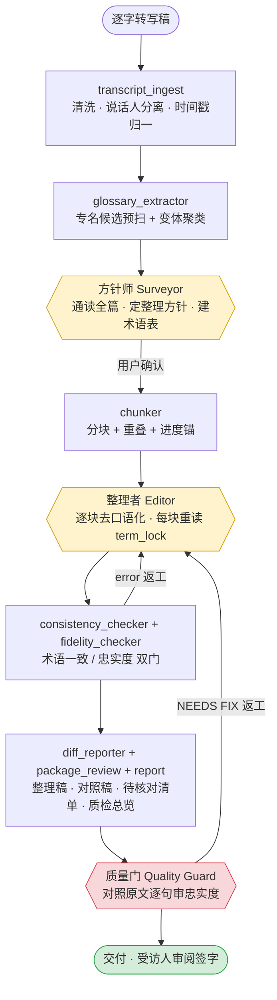

# 口述访谈文字处理工具

### Oral Interview Transcription Toolkit — 一套面向口述史"去口语化—书面化"的方法论驱动型 AI 流水线

[](https://github.com/LeoLin990405/oral-interview-transcription-skill/actions/workflows/test.yml)

---

## 摘要

口述史研究中，访谈逐字稿的整理是最耗时、且最易引入失真的环节。本工具面向**已完成语音转写的逐字稿**（非录音转写本身），提供一条以方法论为约束、以"存真"为最高原则的处理流水线：将口语转写稿整理为忠实、可读、可供受访人审阅签字的**整理稿**（Pass 1 去口语化），并支持在签字稿基础上进一步形成发表级**书面稿**（Pass 2 书面化）。

与"将整段文本一次性交付大模型润色"的朴素做法不同，本工具以**多角色串行流水线 + 机读执行契约 + 范例驱动 + 双重质量门 + 对抗式忠实度审计**为机制，重点解决长文本处理中的两类系统性风险：**漂移**（长文中人名、机构、术语前后不一致）与**越界**（添加受访人未陈述的信息、将不确定改写为确定、为通顺而消解矛盾、以书面化之名抹除方言与个性）。

> **Abstract.** A methodology-grounded pipeline for processing oral-history interview transcripts. It de-oralizes verbatim transcripts into faithful, reviewable editorial drafts (Pass 1) and optionally produces publication-ready prose (Pass 2), while guarding against the two systematic failure modes of LLM-assisted editing on long texts: *drift* (cross-passage inconsistency of names/terms) and *overreach* (fabrication, false certainty, reconciling contradictions, erasing dialect/voice). Fidelity to the recording is the governing principle.

---

## 一、定位与范围

依据"生／熟"加工光谱与"双本制"（陈墨）对处理阶段的界定：

```
原始录音（最"生"）→ 逐字转写稿 → Pass 1 整理稿 → Pass 2 书面稿 → 出版访谈录（最"熟"）
                                  └──────── 本工具处理范围 ────────┘
```

| | 档案本（原始抄本） | 传播本（编辑抄本） |
|---|---|---|
| 定位 | 录音的另存，服务研究与存档 | 公开面世形式 |
| 对应 | 逐字转写 → **Pass 1（去口语化）** | Pass 1 → **Pass 2（书面化）** |

**本工具不进行语音识别（ASR）**，输入应为已转写的逐字稿。Pass 2 须在受访人审阅签字后另行进行（见 [`workflows/pass2-bookify.md`](oral-history-master/workflows/pass2-bookify.md)）。

---

## 二、方法论基础

### 2.1 核心原则：存真优先

录音是史料，整理稿是对录音的"最小干预转写"。整理者的介入应尽可能轻，且全程可回溯至原始录音／逐字稿（可逆性原则）。处理操作的冲突优先级为：**保护 ＞ 转换 ＞ 语境 ＞ 清除**。

### 2.2 文献谱系（P0／P1／P2 分级）

规则系统提炼自下列口述史方法论文献，规则冲突时按级别取舍，同级取更保守方案。文献谱系由本项目方法论合作者 **Kelvin（中国科学技术大学 科技史）** 梳理；完整对照见 [`references/methodology.md`](oral-history-master/references/methodology.md)。

| 级别 | 文献 | 主要约束 |
|---|---|---|
| P0 | 张藜《如何进行口述史访谈》 | 五步整理流程；记录稿与整理稿之别；受访人审阅签字 |
| P0 | 《中华口述历史工作实务规范（试用版）》(2023) | 六阶段流程；逐句对应；改动可追溯；三方签字 |
| P1 | Ritchie《大家来做口述历史》 | 抄本与录音互补；"错误话头"处理；方言不以变形拼写标记 |
| P1 | 陈墨《口述历史门径》(2013) | 双本制；唐德刚式改写之戒；三项核心保留 |
| P1 | 《牛津口述史手册》 | "生／熟"光谱；停顿与犹豫的方法论价值 |
| P2 | 熊卫民《对于历史，科学家有话说》(2017) | 去口语化而不失口语感；脚注五功能体系 |
| — | Portelli《Luigi Trastulli 之死》 | 口误、矛盾、不确定本身即史料，不可"修正"抹平 |

### 2.3 处理体系（A／B／C／D 四类）

- **A 保护（绝不动）**：叙事逻辑与因果判断、功能性情感表达、方言与行话、前后矛盾（保留并标注，不充当裁判）、个性化措辞、科技体制术语、不确定表述。
- **B 清除（口语噪音，静默删除）**：无语义填充词、无修辞重复、采访人倾听性反馈、流程寒暄。
- **C 转换（保守，照范例尺度）**：口误自纠取最终值并标注、口语连接词、口语语法规范、仅补语法成分（不补信息）、时间线不自动重排。
- **D 语境（由开关决定）**：采访人话语去留、方言处理方式、补全力度。

### 2.4 范例驱动

冗长的规则清单会令模型在长文本中漂移；本工具以少量高质量的"原始—整理"对照范例（[`references/examples.md`](oral-history-master/references/examples.md)）确定处理尺度，规则提供"为何如此"，范例提供"改至何种程度"。**整理质量的天花板取决于范例质量，而非规则数量。**

---

## 三、系统设计

**图 1　处理流水线**（黄：AI 角色；红：强制质量门；其余为确定性脚本环节）



四项关键机制：

1. **机读执行契约 `term_lock`**：将术语对照表、受访人语气画像、处理开关固化为机读文件，整理者在处理**每一分块前重读**，以抵抗长文上下文压缩导致的漂移。
2. **分块 + 全局术语锚定**：长访谈分块处理，跨块一致性由脚本校验；`glossary_extractor` 预扫并聚类转写稿中已不一致的专名写法。
3. **双重质量门**：`consistency_checker`（术语变体残留）与 `fidelity_checker`（字数比异常、新增数字／专名疑似捏造、不确定表述疑似删除）。
4. **对抗式忠实度审计**：配套技能 `oral-history-quality-guard` 对照原文逐句核查捏造、伪造确定性、矛盾消解、方言抹除等，通过后方可交付。

**真·可追溯**：以"原始转写 ⟷ 整理稿"逐块对照稿替代不可靠的"改动数量统计"。

---

## 四、使用

核心流水线仅依赖 Python 3.9+ 标准库（`.docx/.xlsx` 输入需可选依赖）。完整步骤见 [QUICKSTART.md](QUICKSTART.md)。

- **作为 Claude / Agent Skill**：将 `oral-history-master/` 与 `oral-history-quality-guard/` 置入 skills 目录，由 Agent 编排执行（推荐，可发挥流程与质量门的完整价值）。
- **手动运行脚本**：见 [`oral-history-master/scripts/README.md`](oral-history-master/scripts/README.md) 与 `run_pipeline.py`（`prep` / `check` 两段编排）。

---

## 五、目录结构

```
oral-interview-transcription-skill/
├── README.md · QUICKSTART.md · CONTRIBUTING-methodology.md
├── oral-history-master/              主流程
│   ├── SKILL.md                      串行门控流水线编排与执行纪律
│   ├── references/                   methodology / surveyor / editor / examples / shared-standards
│   ├── templates/                    edit_spec（整理方针）/ term_lock（执行契约）
│   ├── scripts/                      确定性脚本 + 单元测试 tests/
│   ├── workflows/                    resume-execute（续跑）/ pass2-bookify（书面化）
│   └── projects/demo/                可复核的合成样例
└── oral-history-quality-guard/       配套忠实度审计门
```

---

## 六、局限与有效性边界

本工具仍处于早期阶段，使用者须知悉以下边界：

1. **机械检测为启发式信号，非定论。** 字数比、新增数字／专名、不确定表述删除等检查用于"标记可疑、提交人工复核"，存在误报与漏报；最终忠实度判断须由人（或审计角色对照原文）作出。
2. **整理质量受范例约束。** 当前仓库内置范例为**合成示例**；在真实材料上的逐段整理质量，取决于是否以真实的"原始—整理"对照范例校准（见 [CONTRIBUTING-methodology.md](CONTRIBUTING-methodology.md)）。
3. **有效性验证有限。** 流程的严谨性与可操作性已在真实访谈稿上获得初步验证；对最疑难文本段落的输出质量、以及十万字级规模的长程一致性，尚待系统评测。
4. **不替代人工与受访人审定。** 整理稿须经受访人审阅签字方可使用；本工具是整理者的辅助，而非替代。

---

## 七、研究伦理

1. 不捏造：受访人未陈述的信息不得添加，补全仅限语法成分。
2. 不伪造确定性：不将"大概／记不清"改为肯定表述。
3. 不消解矛盾：前后矛盾予以保留并标注。
4. 不抹除个性：方言、行话、特有措辞属保护项。
5. 授权与署名：整理稿须经受访人审阅签字；署名遵循"某某口述，某某访谈整理"。
6. 录音留存：无录音／原始材料对照的转写稿，关键处保留待核对标记。
7. 本地与保密：流水线本地运行、不外传数据；涉密内容由使用者把关。

---

## 八、参考文献

1. 张藜.《如何进行口述史访谈》.
2. 中国口述历史专业委员会.《中华口述历史工作实务规范（试用版）》. 2023.
3. Ritchie, Donald A. *Doing Oral History*（中译《大家来做口述历史》，第 3 版）.
4. 陈墨.《口述历史门径：实务手册》. 2013.
5. 李向平, 魏扬波.《口述史研究方法》. 2010.
6. *The Oxford Handbook of Oral History*（中译《牛津口述史手册》）.
7. 熊卫民.《对于历史，科学家有话说》. 2017.
8. Portelli, Alessandro. "The Death of Luigi Trastulli, and Other Stories."

---

## 九、引用方式

如在研究或工作中使用本工具，建议引用：

```
口述访谈文字处理工具（oral-interview-transcription-skill）.
方法论：Kelvin（中国科学技术大学 科技史）；工程实现：LeoLin990405. 2026.
https://github.com/LeoLin990405/oral-interview-transcription-skill
```

---

## 作者与致谢

本工具系**共创**成果：方法论梳理与文献谱系由口述史研究者 **Kelvin（中国科学技术大学 科技史）** 完成并提供实测反馈；多角色流水线、一致性与忠实度机制、工程实现由 [**LeoLin990405**](https://github.com/LeoLin990405) 完成。欢迎以自身语料持续改进（见 [CONTRIBUTING-methodology.md](CONTRIBUTING-methodology.md)）；反馈见 [FEEDBACK.md](FEEDBACK.md)。

> 公开仓库——请勿在 issue 中粘贴任何真实访谈内容，举例请用脱敏或合成片段。
