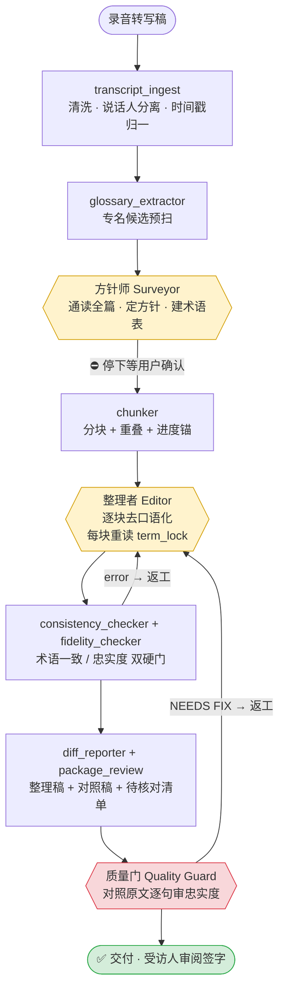

# 口述史整理工具箱 · Oral History Toolkit

[](https://github.com/LeoLin990405/oral-history-toolkit/actions/workflows/test.yml)

> 把录音转写稿，按口述史方法论，转换成**忠实、可读、可供受访人审阅签字**的整理稿。
> 专为长篇访谈（10–20 万字级）设计，**数据全程在本地，工具不联网、不外传任何内容**。

一套两件配套的 Claude / Agent **Skill**：

| Skill | 作用 |
|---|---|
| **[`oral-history-master`](oral-history-master/)** | 主流程：转写稿 → 整理稿（Pass 1 去口语化），多角色串行流水线 + 确定性脚本 |
| **[`oral-history-quality-guard`](oral-history-quality-guard/)** | 配套质量门：交付前对整理稿做**对抗式忠实度审计** |

📖 **新手直达** → [QUICKSTART.md](QUICKSTART.md)　｜　🔍 **看效果** → [`projects/demo/`](oral-history-master/projects/demo/)

---

## 目录

- [它解决什么问题](#它解决什么问题)
- [设计立场：存真 > 可读](#设计立场存真--可读)
- [核心特性](#核心特性)
- [完整流水线](#完整流水线)
- [核心机制（为什么对长文也稳）](#核心机制为什么对长文也稳)
- [方法论谱系](#方法论谱系)
- [A / B / C / D 处理体系](#abcd-处理体系)
- [标记约定](#标记约定)
- [看看效果（demo）](#看看效果demo)
- [快速上手](#快速上手)
- [目录结构](#目录结构)
- [两道工序](#两道工序pass-1--pass-2)
- [伦理红线](#伦理红线)
- [FAQ](#faq)

---

## 它解决什么问题

口述史项目把科学家、亲历者的访谈录音转成文字稿后，需要"去口语化"——删掉口语噪音、理顺语句、统一专名——但**绝不能在这个过程里失真**：受访人的判断、语气、方言、甚至口误和矛盾，都是史料的一部分。

人工做这件事极慢；直接丢给 AI 又容易**漂移**（长文里前后不一致）和**越界**（不知不觉添油加醋、把矛盾"圆"顺、把方言改成教科书腔）。

本工具用**多角色流水线 + 机读契约 + 范例驱动 + 双硬门 + 质量审计**，让 AI 在大体量长文上**既高效又守得住存真底线**。

## 设计立场：存真 > 可读

**录音才是史料，整理稿是对录音的"最小干预转写"。** 整理者的笔越轻越好。

| ✅ 工具会做 | ❌ 工具绝不做 |
|---|---|
| 删口语噪音（嗯/啊/重复/采访人插话） | 添加受访人没说过的信息 |
| 纠显性口误与转写错（标注原口误） | 把"大概/记不清"改成肯定语气 |
| 补最小语法成分（缺主语/连词） | 替受访人圆场前后矛盾 |
| 统一人名/机构/专名写法 | 把方言、行话、个性措辞标准化 |
| 保留判断、情感、不确定、矛盾 | 输出"改了 N 处"之类的假统计 |

## 核心特性

- 🎭 **多角色分工**：方针师（Surveyor）定方针 → 整理者（Editor）逐块整理 → 质量门（Quality Guard）审忠实度
- 🔒 **机读执行契约 `term_lock`**：人名/机构/专名/语气/开关锁定，整理每块前重读，**抗长文上下文漂移**
- 📐 **范例驱动**：执行尺度向金标准范例看齐，而非逐条套规则（规则清单会让 LLM 漂移）
- ✂️ **分块 + 全局术语锚定**：20 万字分块处理，跨块一致性由脚本校验
- 🚦 **双硬门**：`consistency_checker`（术语一致）+ `fidelity_checker`（防添写/删过头）
- 🔎 **对抗式 QA**：配套技能对照原文逐句审，找不到问题才放行
- 📋 **真·可追溯**：产出"原始 ⟷ 整理稿"对照稿，不靠编造统计
- 💻 **零依赖、纯本地**：核心流水线仅需 Python 3.9+ 标准库，数据不出本机

## 完整流水线



黄框 = AI 角色（需读 reference 后执行）；红框 = 强制质量门；脚本是中间的确定性环节。

## 核心机制（为什么对长文也稳）

1. **范例驱动**：执行尺度向 [`references/examples.md`](oral-history-master/references/examples.md) 的 5 个金标准范例看齐。范例把规则隐式编码，比让模型逐条比对 24 条规则稳得多——规则清单在长文里必然漂移。
2. **term_lock 每块重读**：人名/机构/专名/语气画像/开关写进机读契约，Editor 整理**每一块前**都重读它。这是抵抗长文上下文压缩漂移、保证全篇一致的命门。
3. **分块 + 全局术语锚定**：20 万字塞不进一个上下文，分块处理；术语表全局唯一，由脚本校验跨块是否统一。
4. **双硬门 + QA**：`consistency_checker`（变体残留）+ `fidelity_checker`（字数比抓添写/删过头）+ `quality-guard`（对照原文逐句语义审）。任一不过就返工。
5. **真·可追溯**：产出"原始转写 ⟷ 整理稿"对照稿，受访人对照即可核验——而非让 AI 编一个数不准的"改动统计"。

## 方法论谱系

规则蒸馏自口述史方法论经典，按 **P0/P1/P2** 分级（全表见 [`references/methodology.md`](oral-history-master/references/methodology.md)），由口述史研究者 **Kelvin（中科大 科技史）** 系统梳理：

| 级别 | 来源 | 核心约束 |
|---|---|---|
| P0 | **张藜《如何进行口述史访谈》** | 五步整理流程；存真优先；受访人审阅签字 |
| P0 | **《中华口述历史工作实务规范》(2023)** | 六阶段流程；逐句对应；改动可追溯；三方签字 |
| P1 | **Ritchie《大家来做口述历史》** | "错误话头"处理；方言不靠变形拼写标记 |
| P1 | **陈墨《口述历史门径》** | 双本制（档案本/传播本）；唐德刚式改写之诫 |
| P1 | **《牛津口述史手册》** | "生/熟"光谱；停顿犹豫的方法论价值 |
| P2 | **熊卫民《对于历史，科学家有话说》** | 去口语化但不失口语感；脚注五功能 |
| — | **Portelli《Luigi Trastulli 之死》** | **口误、矛盾、不确定本身是史料**，不可被"修正"抹平 |

## A / B / C / D 处理体系

冲突时优先级：**A 保护 > C 转换 > D 语境 > B 清除**（宁可多留，不可误删）。

- **A 类 · 保护（绝不动）**：核心叙事逻辑 / 功能性情感词 / 方言行话 / 前后矛盾 / 个性表达 / 科技体制术语 / 不确定表述
- **B 类 · 清除（静默删）**：填充词 / 无修辞重复 / 采访人倾听反馈 / 流程寒暄
- **C 类 · 转换（保守）**：口误自纠 / 口语连接词 / 口语语法 / 最小语法补全 / 时间线提示（不重排）
- **D 类 · 语境（开关决定）**：采访人话语 / 方言 / 补全力度

## 标记约定

| 标记 | 含义 |
|---|---|
| `〔……〕` | 意义级/可争议改动留痕（口误取舍、词义改写、删实质内容）；纯噪音删除不标 |
| `⚠` | 待核对：人名/机构/专名/同音疑似转写错，**绝不擅自改** |
| `【问】` | 采访人的实质提问（当开关 `interviewer=保留`） |

## 看看效果（demo）

[`projects/demo/`](oral-history-master/projects/demo/) 是一份跑通的**合成样例**（虚构内容）。对比输入输出：

输入（[`raw.txt`](oral-history-master/projects/demo/sources/raw.txt) 节选）：
> 受访人：嗯……我是，我是一九五八年，啊不对，应该是五九年吧，五九年到的中科院半导体所。那时候条件特别特别艰苦…

输出（[`整理稿.md`](oral-history-master/projects/demo/output/整理稿.md) 节选）：
> 【受访人】我是一九五九年到的中科院半导体所。那时候条件特别艰苦，连个像样的实验室都没有。

填充词清掉、口误纠正取最终值、方言「吃皇粮」保留、不确定「也可能是六三年」保留、矛盾「没参加/参加过」保留并标 `⚠`、人名标 `⚠`、术语全篇统一、采访人提问转 `【问】`。

## 快速上手

完整步骤见 [QUICKSTART.md](QUICKSTART.md)。最短路径：

**作为 Skill（推荐）**：把 `oral-history-master/` 和 `oral-history-quality-guard/` 放进 skills 目录（如 `~/.claude/skills/`），对 Claude 说"用 oral-history-master 整理这篇转写稿"。

**手动跑脚本**：
```bash
cd oral-history-master/scripts
python3 project_manager.py init  我的访谈
python3 project_manager.py import 我的访谈 /路径/转写稿.txt --move
python3 transcript_ingest.py     我的访谈
python3 glossary_extractor.py    我的访谈
#  → 人工/Agent：核定 term_lock.md（方针 + 术语表）
python3 chunker.py               我的访谈
#  → 人工/Agent：逐块整理 → work/edited/
python3 consistency_checker.py   我的访谈
python3 fidelity_checker.py      我的访谈
python3 diff_reporter.py         我的访谈
python3 package_review.py        我的访谈
```

## 目录结构

```
oral-history-toolkit/
├── README.md  ·  QUICKSTART.md
├── oral-history-master/              主技能
│   ├── SKILL.md                      7 步串行门控流水线编排 + 执行纪律
│   ├── requirements.txt              核心零依赖；docx/xlsx 可选
│   ├── references/                   渐进披露知识库
│   │   ├── methodology.md            权威文献分级蒸馏：存真哲学 + A/B/C/D
│   │   ├── surveyor.md               方针师角色
│   │   ├── editor.md                 整理者角色
│   │   ├── examples.md               5 个金标准范例（执行尺度基准）
│   │   └── shared-standards.md       标记约定 + I/O 契约 + 伦理
│   ├── templates/
│   │   ├── edit_spec_reference.md    整理方针模板（人读）
│   │   └── term_lock_reference.md    执行契约模板（机读，每块重读）
│   ├── scripts/                      9 个确定性脚本（见 scripts/README.md）
│   │   ├── project_manager · transcript_ingest · glossary_extractor
│   │   ├── chunker · consistency_checker · fidelity_checker
│   │   └── diff_reporter · package_review · config
│   ├── workflows/
│   │   ├── resume-execute.md         20 万字续跑/换窗口
│   │   └── pass2-bookify.md          Pass 2 书面化（独立流程）
│   └── projects/demo/                跑通的合成样例
└── oral-history-quality-guard/
    └── SKILL.md                      对抗式忠实度审计门
```

## 两道工序：Pass 1 & Pass 2

| | Pass 1 去口语化（本工具主流程） | Pass 2 书面化 |
|---|---|---|
| 输入 | 录音转写稿 | **已签字的** Pass 1 整理稿 |
| 目标 | 忠实、可读、可签字 | 发表级：流畅、有结构、合期刊体例 |
| 可否重排篇章 | ❌（仅文末提示时间线） | ✅ |
| 可否提炼删节 | ❌ | ✅（保留关键史实与原意） |
| 不变底线 | 不捏造 | **仍不捏造**；引文/史实/原意不可改 |

Pass 2 流程见 [`workflows/pass2-bookify.md`](oral-history-master/workflows/pass2-bookify.md)，**须在受访人签字后**进行。

## 伦理红线

1. **不可捏造**：受访人没说的信息一个字不能加；补全仅限语法成分。
2. **不可伪造确定性**：不把"大概/记不清"改成肯定。
3. **不可圆场矛盾**：前后矛盾保留 + `⚠`。
4. **不可抹方言/个性**：行话、特有比喻、叙述习惯属保护项。
5. **授权与署名**：整理稿须经受访人审阅签字方可使用。
6. **录音留存**：无录音/原始材料对照的转写稿，关键处保留 `⚠` 并提示核查。
7. **本地与保密**：工具在本地运行，不外传任何数据；涉密内容由使用者把关。

## FAQ

**Q：这工具会把我的访谈数据传到网上吗？**
不会。核心流水线纯本地运行、零联网。作为 Skill 用时，是否调用云端模型取决于你自己的 Agent 配置——脚本本身不发送任何数据。

**Q：AI 不会瞎改、添油加醋吗？**
这正是整套设计要防的：A 类保护 + 范例驱动约束尺度 + `fidelity_checker` 抓异常字数比 + `quality-guard` 对照原文逐句审 + 全程对照稿可回查。

**Q：20 万字一次跑不完怎么办？**
分阶段换窗口续跑，每段从 `term_lock` 重新锚定，见 [`workflows/resume-execute.md`](oral-history-master/workflows/resume-execute.md)。

**Q：方法论我不认可某条规则怎么办？**
规则集中在 `references/`，开关在 `term_lock.md`，都可改。仿真度（高/中/低）、采访人话语、方言、补全力度都是可调开关。

## 反馈与共创

用过有任何问题——报错、整理得不对、想加功能——都欢迎提：仓库 **Issues** 里选模板填，或直接联系作者。详见 [FEEDBACK.md](FEEDBACK.md)。

> ⚠ 公开仓库，**请勿在 issue 里粘贴任何真实访谈内容**；举例请用脱敏/编造的片段或只描述现象。

这套工具是**共创**的：方法论与文献谱系（张藜、中华规范、Ritchie、陈墨、牛津手册、熊卫民等）由口述史研究者 **Kelvin（中科大 科技史）** 系统梳理并实测反馈，工程、流水线与一致性机制由 [LeoLin990405](https://github.com/LeoLin990405) 实现。想用自己的语料持续把它喂得更好（拆书蒸馏 → 规则/范例 → held-out 验证），见 [CONTRIBUTING-methodology.md](CONTRIBUTING-methodology.md)。

---

*存真 > 可读。整理稿须经受访人审阅签字方可使用。*
